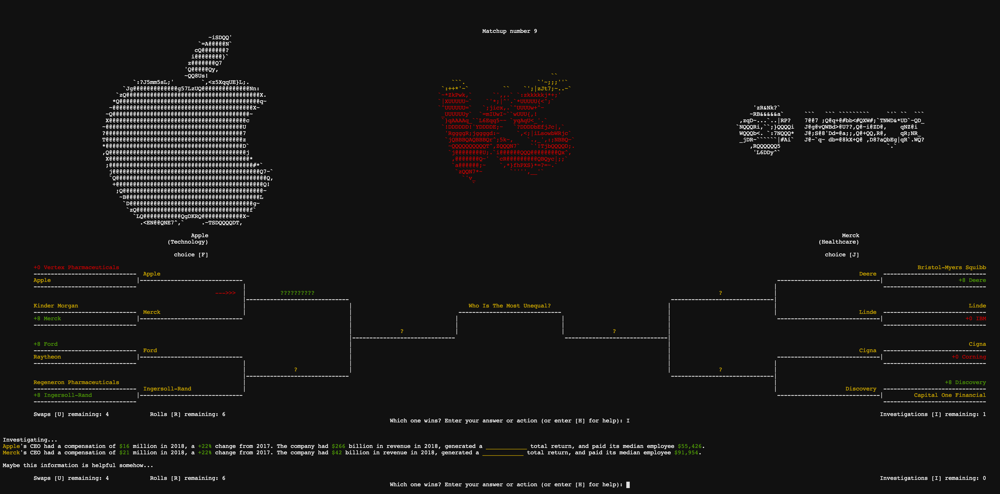
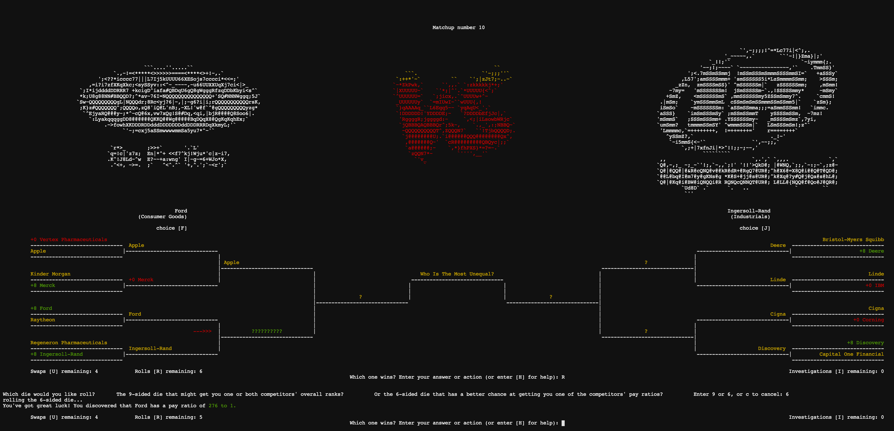
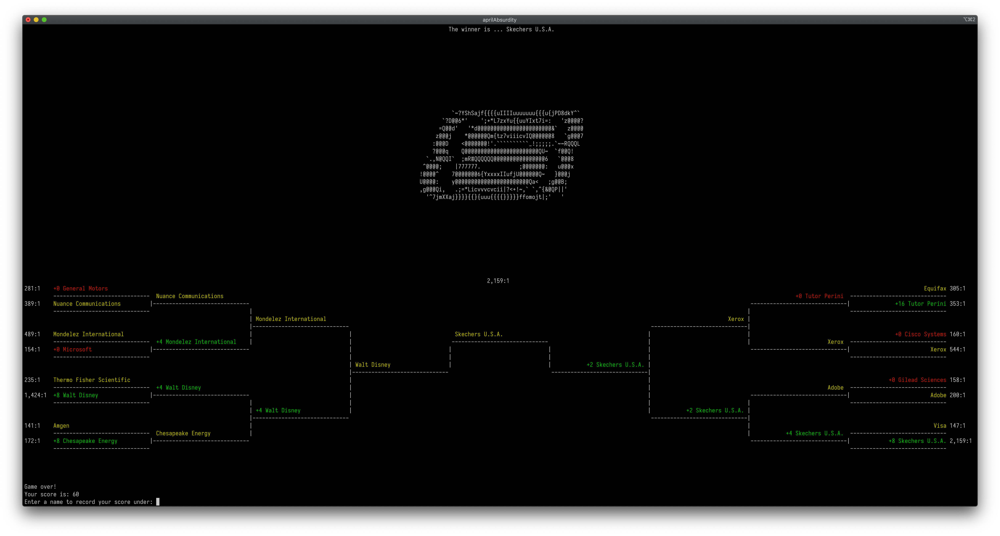

# April Absurdity - tournament game for the terminal written in C++ (final project for CSCI 1300)

Every March, much of the United States watches the country's best college basketball teams compete in a tournament known as March Madness, and it is extremely common to try to predict the outcome of this tournament. Many people fill in a bracket with the teams they think will win each game, some start betting pools with friends and colleagues, and everyone generally just has a lot of fun with the [tantalizing odds](https://www.ncaa.com/news/basketball-men/bracketiq/2020-01-15/perfect-ncaa-bracket-absurd-odds-march-madness-dream) of predicting each game's outcome correctly. Even US Presidents have gotten [their predictions](https://www.obama.org/2019-ncaa/) in.

Every *April*, the majority of the biggest public companies based in the US submit a form called a 'proxy statement' to the US SEC (Securities and Exchange Commission). The information in this form is public, but nobody has made a game from that info... until now! This game is based on (only) data reported by the 197 largest public companies themselves in 2018, as compiled and [re-published](https://www.nytimes.com/interactive/2019/business/highest-paid-ceos-2018.html) by a joint effort of The New York Times and Equilar, an executive compensation and corporate governance data firm. Inequality is a [big deal](https://www.youtube.com/watch?v=cZ7LzE3u7Bw) in the US today, so the question in this game is: 

**Who is the most unequal?**

## Installation

1) run the command `git clone https://github.com/chansonnier/April-Absurdity.git` in your terminal.

2) run the command `g++ -std=c++11 -o aprilAbsurdity Company.cpp Competitor.cpp Industry.cpp main.cpp Tournament.cpp` to compile the game's files into a single output file called aprilAbsurdity.

3) Now you can run the command `./aprilAbsurdity` in your terminal to play the game. 

This game has only been tested on Ubuntu/Linux and macOS, and may or may not have hiccups on Windows.

## How to play
**You really don't need to read all this to jump into a game--you can play by knowing two keys: you just enter the letter `F` to pick the company on the left, or the letter `J` to pick the company on the right. But to get the high score, you might want to read on for some tips and special moves you can make.** 

Each game, a random set of companies is generated. The goal of the game is to get the high score by correctly guessing which company is more unequal than the other in how it pays its median employee vs its CEO. Some companies pay their CEOs 200 times more than their median employee, while for others, it's more like 2000 times more. If you think that say, Ford is more unequal than Apple, you will enter the letter for Ford.

**At every matchup you have five possible moves:** 

* Enter **`F`** to select the competitor on the left, 
* **`J`** to select the competitor on the right, 
* **`U`** to swap an unfamiliar/undesirable competitor out for a new one (but only in the first round, of course!), 
* **`R`** to roll one of two dice for a chance to reveal a useful bit of information on one or both competitors in the current matchup, 
* or **`I`** to more thoroughly investigate both competitors in the current matchup and reveal several data points on each. 

You can also enter **`Q`** to quit or **`H`** to see this help menu in the game.

In each tournament game you can roll **(`R`)** the dice **up to 7 times**, swap out **(`U`)** **up to 4 undesirable or unfamiliar competitors**, and conduct **up to 3 investigations** **(`I`)**. Some additional effects and things to note about these actions:

1) Investigations **(`I`)**: these can reveal very useful information, but your sources can only get you so much information each time, because it is both difficult to gather and difficult not to lose some of the data over the poor connection you have to your sources. You can assume that all info successfully transmitted to you in an investigation is accurate and uncorrupted, but there remain just a handful of cases where the numbers you would like to know aren't derived *precisely* from the accurate numbers that are in front of you...

An example investigation:

2) Unfamiliar/undesirable competitor swaps **(`U`)**: Note first of all that your unfamiliar/undesirable competitor swap actions may make you swap in yet another unfamiliar or undesirable competitor... or you may even swap in a competitor that has a special effect:
    * If your luck has you swap in a competitor from the **Communication Services** industry (such as **Comcast** or **Verizon**), you will **upgrade your connection and no longer lose data in transit when you conduct an investigation.** Unfortunately, there are only 5 such competitors...

    * If your luck has you swap in **BlackRock** or **Goldman Sachs**, then it becomes **much harder to conduct investigations**, since their **Aladdin** and **SecDB** software captures most useful information before you or anyone else can find it.

    * Finally, the more times you roll **(`R`)** the dice, the more likely it is that you will attract **Scientific Games** or **Las Vegas Sands**, and get one of them substituted in at your next swap. If either of these two comes into the tournament, **your luck will be worse when rolling the dice.**

3) Rolling the dice **(`R`)** can still be helpful, because it is the only way you can **discover a competitor's exact CEO-to-employee pay ratio**, or even its **exact rank** as compared to all 196 other possible competitors. Rolling the dice may get you rather useless info sometimes, too, but if you find out that a competitor is ranked, say, 5th or 10th or 20th, or 180th or 190th (out of 197), then you will know that that competitor will be winning/losing most or all of its matchups. Rarely, your roll will even lead you to discover both competitors' ranks in a single matchup...

An example roll of the 6-sided die:

Finally, when playing on All-industries mode (default and only mode in the game right now), you will earn a **2x point multiplier** for any correctly-guessed matchups between competitors from the **same general industry**. Otherwise, the following standard scoring applies: 
* Correct answers in round 1 are worth 8 points, 
* correct answers in round two are worth 4 points, 
* round 3 is 2 points, 
* and the final match is worth 1 point. 

**Thus, the maximum possible score, if every matchup were a same-industry matchup (which is highly improbable), is 170.** 

At the end of the game, pay ratios are revealed, for the winner at the center and for all the competitors at the left and right margins:

Not so long ago, the average ratio in the US was as low as [20 to 1](https://www.youtube.com/watch?v=KyLWYso7omw), but now it's clearly much, much higher.

## More background information

In 2010, the Dodd-Frank Wall Street Reform and Consumer Protection Act was passed in the wake of the global financial crisis and Great Recession, and section 953(b) of this act requires large public companies to calculate certain new data points annually, including the company's median employee's pay and the company's 'CEO pay ratio,' and to include this data in their financial disclosures to the SEC--specifically within a form called the DEF 14A, or 'Proxy Statement.' Five years later, in 2015, this requirement was actually implemented by the Securities and Exchange Commission (SEC), and for calendar-year companies, the first such required disclosure was in 2018, in the 2018 proxy statements for the 2018 annual meetings of shareholders. The data used in this game comes from the following year's disclosures.

Writing in The Wall Street Journal, business school professors Bhavya Mohan of the University of San Francisco and Michael I. Norton of Harvard Business School [report](https://www.wsj.com/articles/consumers-care-about-ceo-employee-pay-ratios-1526868301) that the average CEO-to-employee pay ratio "has soared over the past 40 years to more than 300 to 1 from about 30 to 1." Meanwhile, they write, "Americans believe that the average ratio is 30 to 1, but consider a ratio of just 7 to 1 ideal." This shocking disparity between Americans' perception, ideal, and reality of income inequality is very similar to the disparity in *wealth* inequality Norton and Ariely [had shown](https://people.duke.edu/~dandan/webfiles/PapersOther/Building%20a%20Better%20America.pdf) years earlier, as was visualized in the dramatic graphs of [a popular YouTube video.](https://www.youtube.com/watch?v=QPKKQnijnsM)

It's easy to think there must be a reasonable explanation for all this, but a week before Mohan and Norton's 2018 piece, The Wall Street Journal's own Vanessa Fuhrmans detailed how "CEO Pay and Performance Often Don’t Match Up: The S&P 500 CEOs who received the biggest pay increases scored middling shareholder returns" in [an article](https://www.wsj.com/articles/ceo-pay-and-performance-dont-match-up-1526299200) under that title and subtitle. Perhaps the best explanation of runaway CEO pay in America comes from Steven Clifford, writing in The Atlantic.

"I know [how companies actually decide what to pay CEOs]--for over 20 years, I helped craft some extremely generous executive-compensation packages," [writes](https://www.theatlantic.com/business/archive/2017/06/how-companies-decide-ceo-pay/530127/) Clifford. These compensation packages have no doubt contributed immensely to the nearly [$50 trillion](https://www.rand.org/blog/2020/10/a-25-trillion-question-what-if-incomes-grew-like-gdp.html) that America's 1% ["have taken from the bottom 90%"](https://time.com/5888024/50-trillion-income-inequality-america/) since 1975. Clifford makes it clear that one big way this extreme and growing inequality happens is through the common practice of compensating CEOs in stock, which introduces some very perverse incentives: "in order to make more money from selling the stock they were given, CEOs can induce a higher share price by having the company buy back its own shares", a practice which has lead companies such as Home Depot to spend approximately $4 billion on stock buybacks, money that could otherwise have raised the median employee pay [from $23,000 a year to $41,000](https://www.theatlantic.com/magazine/archive/2019/08/the-stock-buyback-swindle/592774/). In this case, Home Depot's CEO, Craig Menear, announced on a February 2018 conference call Home Depot's “plan to repurchase approximately $4 billion of outstanding shares during the year.” The next day, Menear "sold 113,687 shares, netting $18 million. The following day, he was granted 38,689 new shares, and promptly unloaded 24,286 shares for a profit of $4.5 million. Though Menear’s stated compensation in SEC filings was $11.4 million for 2018, stock sales helped him earn an additional $30 million for the year."

Rather than go too much into the details of how and why this has happened and continues to happen, however, this game merely uses the NYT/Equilar data and generates a random tournament of 16 of some of the biggest public companies by revenue to let the player aim for the high score through solving the question: 'Who is the most unequal?'

## Other context, background, interpretations, and implications:

###    Why this issue is extremely important--start here:
* 'The Spirit Level: Why More Equal Societies Almost Always Do Better'. Richard Wilkinson and Kate Pickett, Bloomsbury Press (2009). (https://www.bloomsbury.com/us/the-spirit-level-9781608191703/)
        
   * [This TED Talk](https://www.youtube.com/watch?v=cZ7LzE3u7Bw) by one of the authors, Richard Wilkinson: "How economic inequality harms societies"].

###    How did this happen?

#### on runaway CEO compensation:
* "How Companies Actually Decide What to Pay CEOs: I know—for over 20 years, I helped craft some extremely generous executive-compensation packages." [The Atlantic](https://www.theatlantic.com/business/archive/2017/06/how-companies-decide-ceo-pay/530127/) (June 2017)
#### more broadly:
* 'The Vanishing Middle Class'. Peter Temin, MIT Press (2017).

* 'A Brief History of Neoliberalism'. David Harvey, Oxford University Press (2007).

* 'The Nobel Factor: The Prize in Economics, Social Democracy, and the Market Turn'. Avner Offer and Gabriel Soderberg, Princteon University Press (2017).

* 'Race and the Origins of American Neoliberalism'. Randolph Hohle, Routledge (2015).

* 'Racecraft: The Soul of Inequality in American Life'. Karen E. Fields and Barbara J. Fields, Verso Books (2014).

* 'Dog Whistle Politics: How Coded Racial Appeals Have Reinvented Racism and Wrecked the Middle Class'. Ian Haney Lopez, Oxford University Press (2014).
   * or Haney Lopez's [talk on YouTube](https://www.youtube.com/watch?v=H6A3NQiJpH0): "Dog Whistle Politics: Coded Racism and Inequality for All" - Brown University Center for the Study of Race + Ethnicity in America 

###    Where the US is now: 
* 'Democracy Incorporated: Managed Democracy and the Specter of Inverted Totalitarianism'. Sheldon Wolin, Princeton University Press (2008). (https://press.princeton.edu/books/paperback/9780691178486/democracy-incorporated)

###    What could be part of a solution:
* More effective trade unions with higher membership rates

* [Codetermination](https://bigthink.com/politics-current-affairs/what-is-codetermination)

* An end to so-called ["right-to-work"](https://en.wikipedia.org/wiki/Right-to-work_law) laws/a repeal of the [Taft-Hartley Act](https://en.wikipedia.org/wiki/Taft%E2%80%93Hartley_Act)

* [Richard Wolff: "Democracy at Work: A Cure for Capitalism" | Talks at Google](https://www.youtube.com/watch?v=ynbgMKclWWc)
